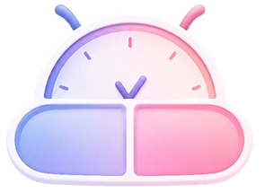

    

<h1 align="center"><a href="https://haxzxz.github.io/Medicine-Intake-Reminder-App/">ZAM: Zealous Assistant for Medication</a></h1>

A voice-powered medicine reminder application designed to help users of all ages manage their medication schedules with ease. By combining smart reminders, voice commands, and medicine information, the app ensures that users never miss a dose. It also maintains logs and a history for better tracking, making it especially useful.  

<h6 align="center"><i>Note: This branch is for github page deployment only, for the source code please see the <a href="https://github.com/haxzxz/Medicine-Intake-Reminder-App/tree/main">Main Branch</a></i></h6>